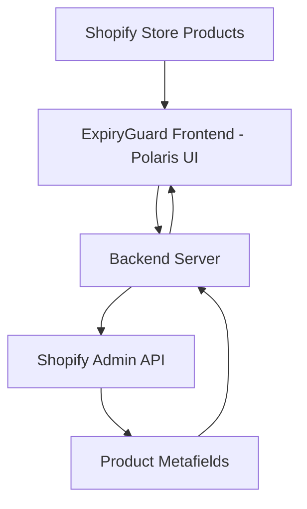
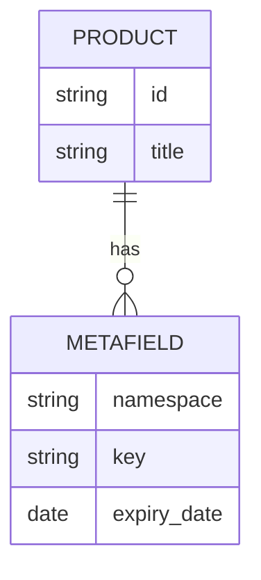

# 📦 ExpiryGuard – Shopify Product Expiry Tracker

*A simple, powerful Shopify app to track product expiry & freshness using metafields*

---

## 🎯 Project Goal

Build a lightweight Shopify app that:

* Allows merchants to add **expiry dates** to products
* Automatically tracks product freshness
* Displays clear status indicators:

  * 🟢 Fresh
  * 🟡 Expiring Soon
  * 🔴 Expired

All data will be stored using **Shopify Metafields**.

---

## 🚀 Why This Project Is Great for Learning

✅ Uses Shopify Admin API
✅ Practices Metafields (real-world skill)
✅ Strong Polaris UI experience
✅ Simple but realistic backend logic
✅ Portfolio-worthy app

---

## 🧩 Core Features (Day-1 MVP)

### 1️⃣ Fetch Store Products

* Load all products via Admin API
* Display in Polaris table

Columns:

| Product | Expiry Date | Status | Action |
| ------- | ----------- | ------ | ------ |

---

### 2️⃣ Add Expiry Date (Metafield)

Metafield structure:

```text
namespace: expiry_guard
key: expiry_date
type: date
value: YYYY-MM-DD
```

Users select date via DatePicker and save.

---

### 3️⃣ Backend Expiry Logic

Simple date comparison:

```text
If today > expiry_date → 🔴 Expired
If expiry_date - today ≤ 7 days → 🟡 Expiring Soon
Else → 🟢 Fresh
```

---

### 4️⃣ UI Status Display

Use Polaris Badge or colored text to show status clearly.

---

## 🔄 Full Data Flow



---

## 🗃 Data Architecture



---

## ⏱ One-Day Build Plan

### 🌅 Morning

* Setup app
* Fetch & display products

### ☀️ Afternoon

* Add expiry date picker
* Save metafields

### 🌆 Evening

* Implement expiry logic
* Show status badges

---

## 📈 Future Scaling Ideas (Later)

* Email alerts for expiring products
* Dashboard summary
* Filter expired items
* Auto-tag expired products
* Bulk date editor

(Not needed for MVP)

---

## 🧠 Key Skills You’ll Master

* Shopify Metafields
* Polaris Components
* Backend API flows
* Date handling
* Clean UI logic

---

## 🏁 MVP Success Criteria

✅ Products load correctly
✅ Expiry dates save
✅ Status updates properly
✅ Clean UI experience

---

### 💡 Project Motto

> Simple logic. Real-world value. Strong Shopify fundamentals.
