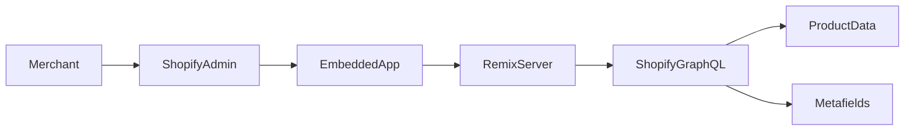
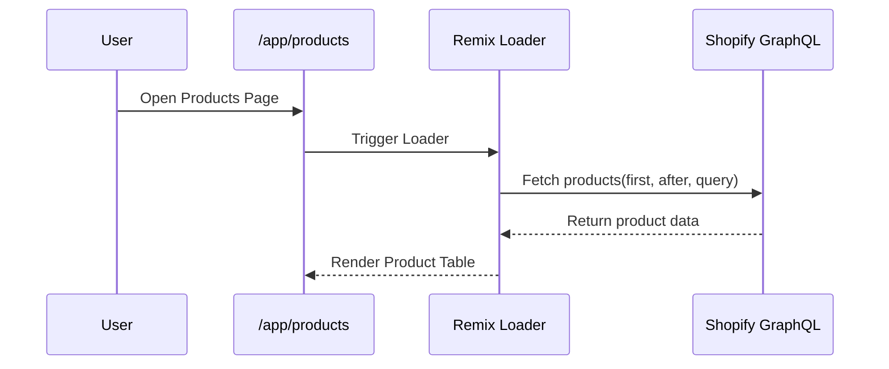
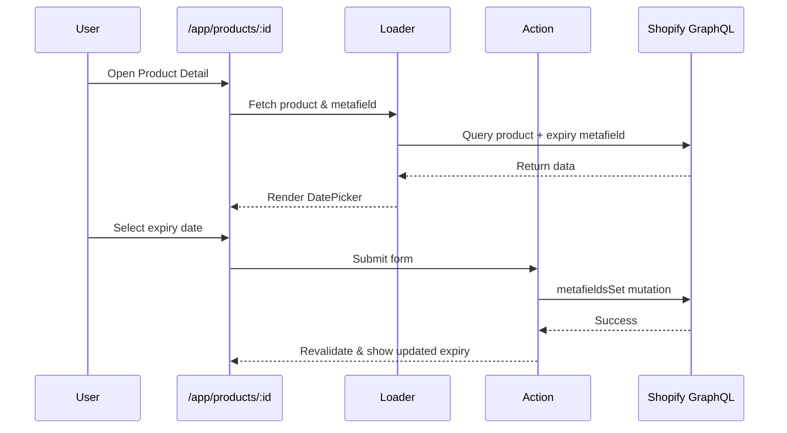
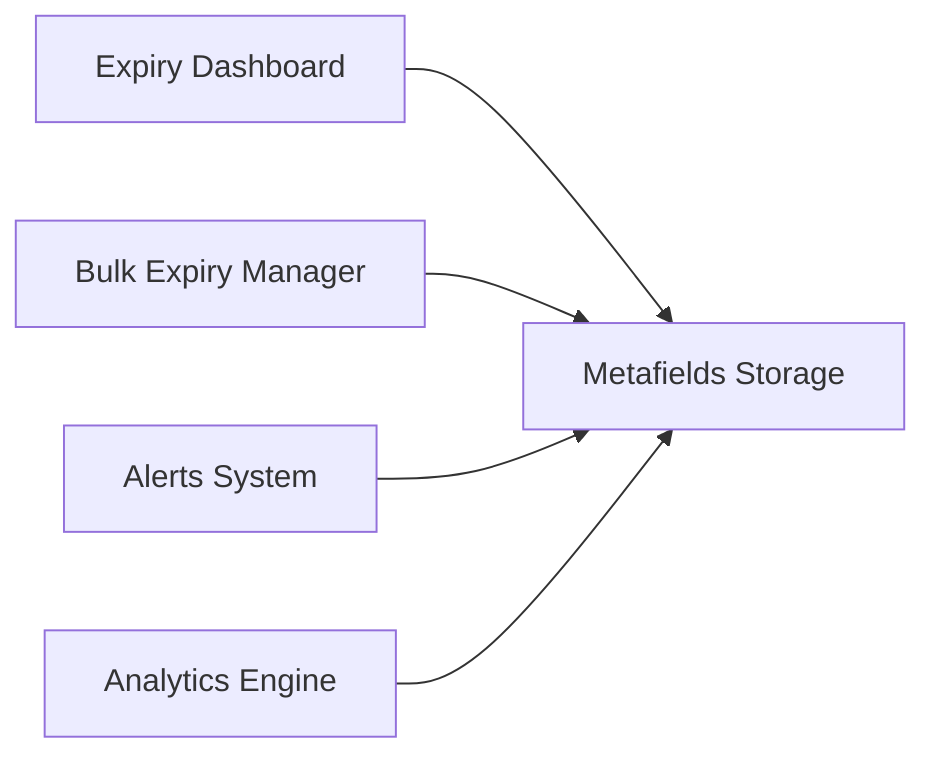

# ExpiryGuard — Project Vision & Architecture

## 1. Project Overview

**ExpiryGuard** is a Shopify Embedded Application built using the Shopify Remix App Template and GraphQL Admin API.

The purpose of this app is to allow Shopify merchants to:

* Assign expiry dates to products
* Track expiry status
* Identify expired or soon-to-expire inventory
* Manage product freshness directly inside Shopify Admin

Shopify does not provide built-in expiry tracking.
ExpiryGuard solves this limitation using Shopify metafields.

---

# 2. Core Problem

Shopify Products do not have:

* Built-in expiry fields
* Expiry monitoring
* Expiry alerts
* Expiry dashboards

Merchants selling:

* Food products
* Cosmetics
* Medicines
* Supplements
* Perishable goods

Need expiry tracking to avoid:

* Selling expired products
* Inventory waste
* Compliance issues

ExpiryGuard introduces a structured expiry management layer.

---

# 3. Core Solution Strategy

ExpiryGuard stores expiry dates using Shopify Metafields.

Metafield Structure:

```
namespace: expiry_guard
key: expiry_date
type: date
```

The expiry date is attached directly to the Shopify Product resource.

No external database is used.

Shopify Metafields act as the storage layer.

---

# 4. High-Level Architecture



### Components Explained

* **Merchant** → Uses Shopify Admin
* **EmbeddedApp** → ExpiryGuard inside iframe
* **RemixServer** → Handles loaders & actions
* **ShopifyGraphQL** → Data layer
* **Metafields** → Expiry storage

---

# 5. Application Flow

## 5.1 Product Listing Flow



### Features on This Page

* Product image
* Product title
* Expiry status badge
* Add / Update expiry button
* Cursor-based pagination
* Debounced search

---

## 5.2 Product Detail Flow



---

# 6. Expiry Status Logic

ExpiryGuard calculates status dynamically:

```javascript
if (expiryDate < today)
    status = "Expired"

else if (expiryDate within next 7 days)
    status = "Expiring Soon"

else
    status = "Fresh"
```

Status Indicators:

* 🟢 Fresh
* 🟡 Expiring Soon
* 🔴 Expired

This logic runs on the frontend for display.

---

# 7. Routing Structure

```
/app/products
/app/products/:id
```

File Structure:

```
app/routes/app.products.jsx
app/routes/app.products.$id.jsx
```

Navigation:

```
useNavigate()
```

Reason:
Embedded apps must avoid `<a href>` to prevent iframe reload.

---

# 8. Data Flow Overview

```mermaid
flowchart TD
    A[User Action] --> B[Remix Loader/Action]
    B --> C[authenticate.admin()]
    C --> D[Shopify GraphQL Admin API]
    D --> E[Products]
    D --> F[Metafields]
    E --> G[UI Render]
    F --> G
```

---

# 9. Technology Stack

## Frontend

* Remix
* Polaris Web Components
* Shopify App Bridge

## Backend

* Shopify GraphQL Admin API
* authenticate.admin(request)

## Storage

* Shopify Metafields
* No external database

---

# 10. Current Implementation Status

## Completed

* Embedded app setup
* Product listing page
* GraphQL product fetching
* Pagination
* Debounced search
* Product detail routing
* Metafield mutation (metafieldsSet)

## In Progress

* Fetch expiry metafield on detail page
* Display expiry badge on listing
* UI improvements

---

# 11. Future Vision (Scalability Plan)

ExpiryGuard is designed to evolve into a production-grade app.

### Planned Features

* Expiry Dashboard
* Filter by expiry status
* Sort by expiry date
* Bulk expiry updates
* Expiry alerts
* Inventory risk insights
* Analytics for expiry trends
* Webhook-based expiry reminders

---

# 12. Long-Term Architecture Vision



Future scaling may introduce:

* Background jobs
* Shopify webhooks
* Scheduled expiry checks
* Optional external database for analytics

---

# 13. Project Philosophy

ExpiryGuard is built to:

* Master Shopify GraphQL deeply
* Understand metafields architecture
* Build real embedded apps properly
* Follow production-grade patterns
* Scale cleanly in the future

This is not just a practice project.

It is a foundation for a scalable Shopify SaaS application.

---

# 14. If You Are a Contributor

Welcome.

Please understand:

* No external database is used intentionally.
* Metafields are the source of truth.
* Embedded routing constraints must be respected.
* GraphQL queries should remain efficient.
* Architecture decisions prioritize scalability.

Before adding features:

* Maintain clean separation between loader and action
* Avoid unnecessary API calls
* Respect cursor-based pagination patterns

---


End of Document.
